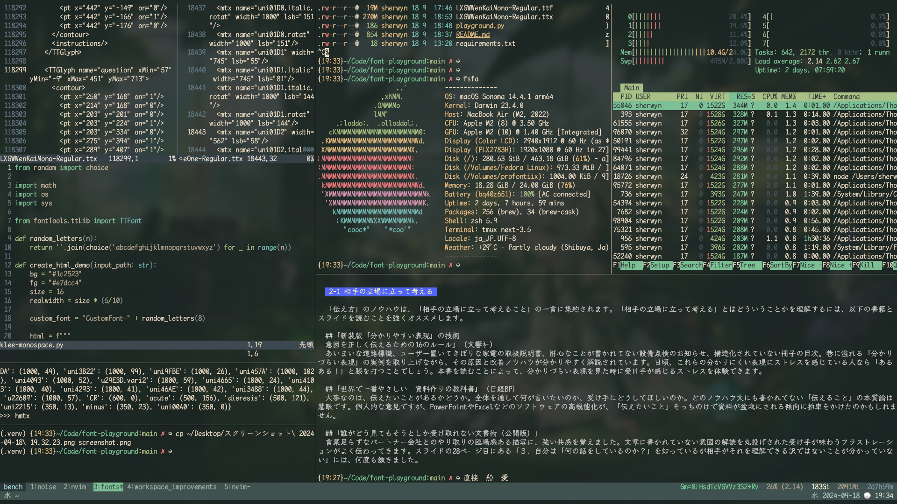

等幅Klee Oneフォント


## パッチする方法
1. 前提として[`fonttools`](https://github.com/fonttools/fonttools)をインストールする
2. [Klee One](https://fonts.google.com/specimen/Klee+One)をダウンロードする
3. [LXGWWenKai](https://github.com/lxgw/LxgwWenKai)をダウンロードする
4. 両方のフォントをこのディレクトリに置く
5. `python klee-monospace.py KleeOne-Regular.ttf LXGWWenKaiMono-Regular.ttf; python klee-monospace.py KleeOne-SemiBold.ttf LXGWWenKaiMono-Bold.ttf`
6. `demo.html`を開いて確認する

## [kitty](https://github.com/kovidgoyal/kitty)のおすすめの設定
```
font_family KleeOneMonospace
font_size 16

modify_font cell_width 100%
modify_font cell_height 80%
modify_font baseline 5
text_composition_strategy 3.0 10 # こちらがディスプレイによって要調整
```
